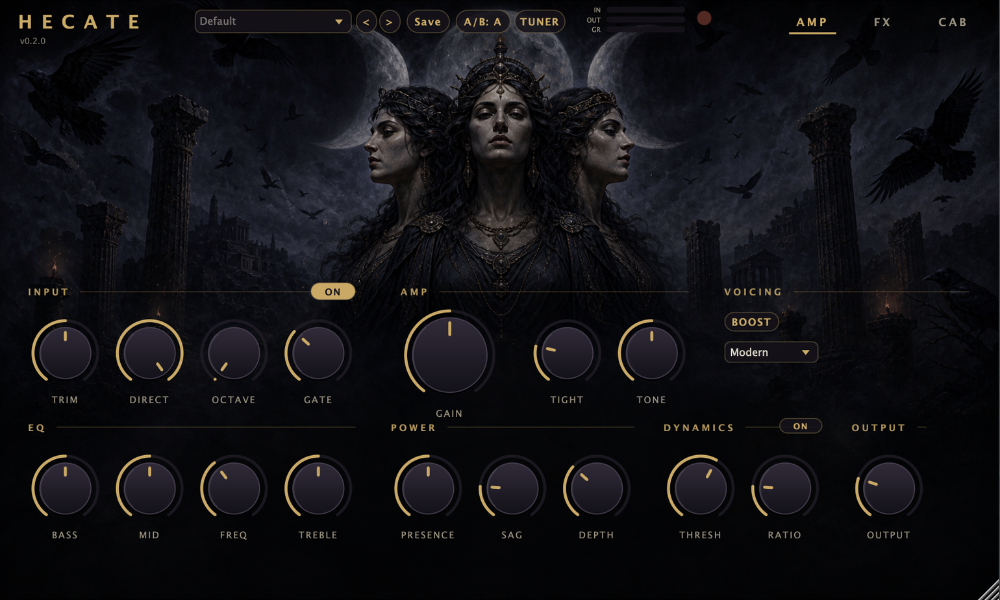

# Hecate

[](https://github.com/dogematti/Hecate-Plugin/actions/workflows/build.yml)

A metal guitar amp suite plugin (AU + VST3 + Standalone) built with JUCE 8 and C++17.
Tuned for extended-range guitars: split-band drive keeps a 7-string's low B tight
*and* full, and the factory presets are voiced for modern metal out of the box.



## Signal chain

```
Input Trim → Gate → Octaver → Compressor → Amp (tight / boost / gain / tone,
split-band, 4x oversampled) → 3-Band EQ → Power Amp (sag / presence / depth)
→ Dual Cabinet IR → Chorus → Doubler → Delay → Reverb → Output → Limiter
```

- **Octaver** — pedal-style octave-down with independent **Direct** (guitar) and
  **Octave** (sub) level knobs: turn Direct off to play the sub-octave voice alone
- **Noise Gate** — custom gate keyed off the raw input with hysteresis (4 dB) and
  hold (20 ms) so palm-mute decays never chatter; switchable, with an activity LED
- **Compressor** — pre-drive sustain compressor with auto make-up gain and a GR meter
- **Amp** — five channels (**Clean / Rhythm / Lead / Thall / Doom**), each a full
  voicing-table row: gain staging, interstage filtering, dynamic asymmetry, clip
  curve and boost corner all change together. Split-band drive keeps low-B full
  while the high band runs a cascaded three-stage clipper at 4x oversampling;
  **Tight** sweeps the pre-drive high-pass 40–300 Hz, **Clean Blend** mixes the
  undistorted take back in post-cab, and **Drop Tune** shifts the whole guitar
  down up to 4 semitones
- **EQ** — bass shelf (100 Hz), **semi-parametric mid** (250 Hz–2 kHz — metal
  scoops live at 350–700 Hz), treble shelf (8 kHz)
- **Power Amp** — **Sag** (touch-responsive bloom), **Presence** (3.5 kHz) and
  **Depth** (100 Hz resonance) — the "chest thump" controls
- **Dual Cabinet IR** — two slots with equal-power blend, low/high trim filters,
  and a real captured IR ("Hecate Cab") built into the binary so it sounds like
  a miked cabinet with zero setup
- **Doubler** — quad-track-style widener with drifting ghost takes
- **Chorus / Delay / Reverb** — delay is free or tempo-synced with damped feedback;
  reverb is Freeverb-style true stereo with width, damping and pre-delay
- **Output limiter** — always-on safety ceiling; no preset can clip the host

## Cabinet IR + mic placement browser

The CAB tab loads impulse responses into two blendable slots and understands
mic-organised packs: if slot A's IR lives in a layout like
`<pack>/<mic>/<position>.wav` (for example the free [overdriven.fr](https://overdriven.fr)
sets), the **Mic** and **Position** menus step through the pack. IR paths are
saved with the session, with a fallback search in `~/Documents/Hecate/IRs`.

Third-party IR files are not included in this repository — most IR licenses
forbid redistributing them with software. Download packs yourself and keep
them in `~/Documents/Hecate/IRs`.

## UI

Three tabs — **AMP**, **FX** and **CAB** — over the artwork at its native
aspect ratio. Header: preset menu with prev/next arrows, save, **A/B compare**,
a **chromatic tuner**, and always-visible in/out/GR meters plus a gate LED.
The CAB tab plots the **frequency response of both IR slots** with live trim
markers, and dragging any EQ or power-section knob overlays the combined
tone curve. Resizable 50–200%, double-click-to-default knobs, tooltips
everywhere, undo/redo with Cmd+Z.

## Presets

Nine factory presets — Modern Rhythm, **7-String Rhythm**, **7-String Scoop**,
Djent, Doom (fuzz voicing), Solo Lead, Clean Shimmer, Ambient Swells + Default —
exposed as host programs and in the preset menu. User presets save as XML to
`~/Documents/Hecate/Presets`.

## Quick start

Load the **7-String Rhythm** preset, then shape to taste: **Tight** for chug
tightness, **Depth** for low-end thump, **Mid/Freq** to place the scoop, and
drop your own cab IRs into `~/Documents/Hecate/IRs` (the CAB tab browses
mic-organised packs automatically).

## Building

Requires CMake 3.22+ and a C++17 compiler. JUCE is fetched automatically.

```bash
cmake -B build -DCMAKE_BUILD_TYPE=Release
cmake --build build -j
```

macOS builds AU + VST3 + Standalone and installs the plugins to
`~/Library/Audio/Plug-Ins/` (`auval -v aufx Hct1 Hcte` re-validates);
Linux/Windows build VST3 + Standalone. CI builds macOS and Linux on every
push and runs pluginval against the VST3.
